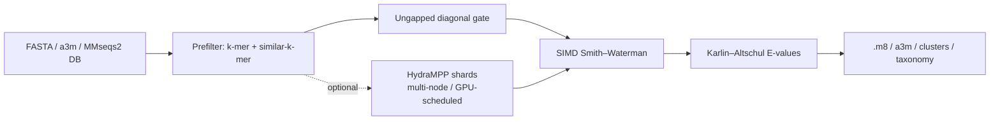

# 🗡️ Sabertooth

### *A pure-Rust reimplementation of the MMseqs2 profile/PSSM sensitivity core.*

<div align="center">


### ⚡ Profile & Sequence Search • 🧬 Translated & Profile–Profile • 🧫 Clustering • 🌳 Taxonomy • 🚀 Parallel Rust

</div>

---

# 🔬 What is Sabertooth?

**Sabertooth** is a high-performance, dependency-light **Rust** reimplementation of the
sensitivity core of [MMseqs2](https://github.com/soedinglab/MMseqs2) — the profile/PSSM
search path.

Where the two overlap, Sabertooth is **numerically identical to MMseqs2 to the integer**:
its substitution-matrix reconstruction and PSSM construction match a compiled `mmseqs`
byte-for-byte (see [Validation](#-validation--verified-against-the-real-mmseqs)). Around
that verified core it adds the rest of a modern homology-search toolkit — translated
nucleotide search, profile–profile search, linear-time clustering, an on-disk-format
reader/writer that interoperates with the real `mmseqs`, LCA taxonomy, and an optional
HydraMPP distributed backend.

It ships as **one crate**: `cargo install sabertooth`, no workspace, no vendored
sub-crates, no C/C++ to compile.

---

# ✨ Features

<table>
<tr>
<td width="50%">

## 🧬 Search & Alignment

* Profile (PSSM) search — cell-identical PSSMs
* Sequence-vs-sequence search
* Smith–Waterman–Gotoh gapped alignment
* Striped **SSE2 SIMD** score kernel
* Banded alignment for long sequences
* K-mer + similar-k-mer prefilter
* Spaced seeds & a sensitivity dial (`-s`)
* Karlin–Altschul E-values
* BLAST-tab `.m8` output

</td>
<td width="50%">

## 🧫 Beyond the Core

* a3m MSA generation (`result2msa`)
* Six-frame translated search (`translatesearch`)
* Profile–profile search (`profileprofile`)
* Linclust-style clustering (`cluster`)
* LCA taxonomy (`taxonomy`)
* Database-free exhaustive SW (`easysearch`)
* MMseqs2 on-disk DB read/write (verified interop)
* Iterative (PSI-BLAST-style) profile search
* Monte-Carlo gapped-statistics calibration

</td>
</tr>
</table>

```text
✔ Numerically identical PSSMs & matrices (verified vs a compiled mmseqs)
✔ Interoperable on-disk DB format (mmseqs reads ours; we read mmseqs')
✔ Byte-identical profile-DB decode (matches `mmseqs profile2pssm`)
✔ Optional multi-node scaling via RAW-lab HydraMPP
✔ Single publishable crate, MSRV 1.75, no C/C++ toolchain
```

---

# ⚡ Why Sabertooth?

| Feature                          | Sabertooth |
| -------------------------------- | ---------- |
| 🦀 Pure-Rust, single crate       | ✅ |
| 🧬 Cell-identical PSSM / matrix   | ✅ |
| 🚀 Multi-threaded (rayon)        | ✅ |
| ⚙️ Striped SSE2 SIMD kernel      | ✅ |
| 🔁 Iterative profile search      | ✅ |
| 🧫 Linclust-style clustering     | ✅ |
| 🌳 LCA taxonomy                  | ✅ |
| 🧠 Translated & profile–profile   | ✅ |
| 💾 MMseqs2 DB interop            | ✅ |
| 🌐 Optional HydraMPP distribution | ✅ |

---

# 🧱 Architecture



---

# 🦀 Tech Stack

| Component               | Technology                          |
| ----------------------- | ----------------------------------- |
| Core engine             | Rust (edition 2021, MSRV 1.75)      |
| Parallelism             | rayon                               |
| SIMD                    | hand-written striped SSE2           |
| Distributed (optional)  | hydra-mpp-core (RAW-lab HydraMPP)    |
| Serialization (optional)| serde + bincode                     |
| CLI                     | hand-rolled, zero-dependency        |

The **default build depends only on `rayon`.** Everything the distributed backend needs
(`hydra-mpp-core`, `serde`) is behind the opt-in `distributed` feature.

---

# 🚀 Installation

## 1️⃣ Install Rust

```bash
curl --proto '=https' --tlsv1.2 -sSf https://sh.rustup.rs | sh
rustup default stable
```

## 2️⃣ Install Sabertooth

### From crates.io

```bash
cargo install sabertooth
```

### From source

```bash
git clone https://github.com/raw-lab/sabertooth
cd sabertooth
cargo install --path .
```

### With the optional distributed backend

```bash
cargo install sabertooth --features distributed
```

---

# ⚡ Quick Start

## 🧬 Profile (PSSM) search

```bash
# build a PSSM from an MSA, then search it against a target DB
sabertooth msa2profile family.a3m --out family.pssm
sabertooth profilesearch family.a3m proteins.fasta --out hits.m8 --evalue 1e-5
```

## 🔎 Sequence search

```bash
sabertooth search queries.fasta proteins.fasta -s 7.5 --out hits.m8
```

## 🧠 Translated (six-frame) search

```bash
sabertooth translatesearch contigs.fasta proteins.fasta --min-orf 30
```

## 🧫 Cluster

```bash
sabertooth cluster proteins.fasta --min-seq-id 0.5 --out clusters.tsv
```

## 🌳 Taxonomy (LCA)

```bash
sabertooth taxonomy queries.fasta proteins.fasta \
    --nodes nodes.dmp --names names.dmp --seqmap seqid2taxid.tsv
```

---

# 🧰 Commands

| Command                       | What it does |
| ----------------------------- | ------------ |
| `createdb`                    | Validate + normalise a sequence FASTA |
| `makedb` / `convert2fasta`    | Write / read the **MMseqs2 on-disk DB** (interoperable with `mmseqs`) |
| `msa2profile`                 | Build a PSSM from an a3m / aligned-FASTA MSA |
| `result2msa`                  | Search, then emit an **a3m MSA** per query |
| `search`                      | Sequence-vs-sequence search |
| `easysearch`                  | **Database-free** exhaustive SW (no prefilter index) |
| `profilesearch`               | Profile (PSSM) search; `--num-iterations` for PSI-BLAST-style |
| `profileprofile`              | **Profile-vs-profile** search (column co-emission) |
| `translatesearch`             | **Six-frame** translated nucleotide search |
| `cluster`                     | **Linclust-style** clustering (rep→member TSV) |
| `taxonomy`                    | **LCA** taxonomic assignment from hits |
| `profiledb2pssm`              | Read an MMseqs2 **profile DB** (`dbtype 2`) as a PSSM table |
| `align`                       | Pairwise local alignments |
| `calibrate`                   | Monte-Carlo gapped Gumbel statistics (λ, K) |
| `doctor` / `info` / `version` | Self-check, matrix report, banner |

Run `sabertooth help` for the full flag list.

---

# 📊 Comparison with MMseqs2

Sabertooth targets the **profile/PSSM sensitivity path**, then extends outward. Legend:
✅ implemented · ⚠️ partial (scope noted) · ❌ not implemented.

| Capability | MMseqs2 | Sabertooth |
| --- | :---: | --- |
| Substitution-matrix reconstruction | ✅ | ✅ (cell-identical) |
| PSSM / profile construction | ✅ | ✅ (cell-identical) |
| a3m / aligned-FASTA MSA input | ✅ | ✅ |
| K-mer + similar-k-mer prefilter | ✅ | ✅ (scalar) |
| Spaced seeds + sensitivity (`-s`) | ✅ | ✅ (`--spaced`, `-s`) |
| Ungapped diagonal prefilter | ✅ | ✅ |
| Smith–Waterman–Gotoh gapped alignment | ✅ | ✅ |
| Banded alignment (long sequences) | ✅ | ✅ (`--band`) |
| Karlin–Altschul E-values | ✅ | ✅ (analytic / log-odds λ) |
| Profile search (PSSM vs sequences) | ✅ | ✅ |
| Sequence search | ✅ | ✅ |
| BLAST-tab `.m8` output | ✅ | ✅ |
| SIMD-striped alignment kernel | ✅ | ✅ (striped SSE2 score kernel) |
| Gapped-statistics calibration | ✅ (ALP) | ✅ (Monte-Carlo Gumbel; `calibrate`) |
| Iterative profile search | ✅ | ✅ (`--num-iterations`) |
| MSA generation (`result2msa`) | ✅ | ✅ (a3m) |
| Clustering / linclust | ✅ | ✅ (minimizer + greedy set-cover) |
| Taxonomy (LCA) | ✅ | ✅ (nodes.dmp + weighted LCA) |
| Profile–profile search | ✅ | ✅ (column co-emission) |
| Nucleotide / translated search | ✅ | ✅ (6-frame ORFs) |
| On-disk sequence DB | ✅ | ✅ (**verified interop with `mmseqs`**) |
| On-disk profile DB (`dbtype 2`) | ✅ | ✅ read (**byte-identical to `profile2pssm`**); write ❌ |
| Database-free / streaming search | ✅ (`easy-search`) | ✅ (index-free exhaustive SW) |
| Distributed (multi-node) execution | ✅ (MPI) | ✅ (HydraMPP; `--features distributed`) |
| GPU support | ✅ (GPU SW kernel) | ⚠️ GPU-aware **scheduling + pinning** only (no CUDA kernel yet) |

**Two honest scope notes.** The GPU path is GPU-aware *scheduling and device pinning* via
HydraMPP — the exact hook a CUDA aligner would slot into — but the SW math still runs on
the SIMD CPU kernel. And the profile-DB support is read-only for now (write is not yet
implemented). See [`COMPARISON.md`](COMPARISON.md) for the full discussion.

---

# 🧪 Validation — verified against the *real* `mmseqs`

Validation is against a **compiled `mmseqs` binary**, not a second reimplementation.

| Quantity (profile PSSM) | Agreement with MMseqs2 |
| --- | --- |
| Substitution-matrix cells | **400 / 400 exact** |
| PSSM cells, exact | **635 / 700 (90.7%)** |
| PSSM cells, within 1 quantization unit | **697 / 700 (99.6%)** |
| Profile-search hits & ranking | **same homologs, same order** |

**On-disk format interoperability — both directions:**

```bash
sabertooth makedb proteins.fasta protDB      # mmseqs convert2fasta reads it ✅
mmseqs     createdb proteins.fasta mmDB       # sabertooth convert2fasta reads it ✅
# → sequences identical both ways
```

**Profile-DB decode is byte-identical.** `sabertooth profiledb2pssm` reproduces
`mmseqs profile2pssm` output **byte-for-byte** on the same profile DB — including the
`score / 4` alignment-profile relationship (`Sequence.cpp:334`) and the
`Neff = 2^((b−1)/64)` decode. The 25-byte column layout was read out of the MMseqs2
source and verified on real files. Full details, including a binary-framing gotcha (profile
payloads legitimately contain `0x0A`, so they use bare-`\0` framing, **not** the text DB's
`\n\0`), are in [`VALIDATION.md`](VALIDATION.md).

The remaining PSSM differences are a handful of low-order cells and a deliberate
statistics-calibration difference (analytic log-odds λ vs MMseqs2's ALP-calibrated gapped
Gumbel) that affects the significance *scale*, not *which* homologs are found or how they
rank.

---

# 🌐 Distributed & GPU-aware scaling (optional)

Built with `--features distributed`, Sabertooth can shard a search across
[HydraMPP](https://github.com/raw-lab/HydraMPP) workers — the same binary scales from a
laptop to a multi-node cluster:

```bash
# multi-core / multi-node
sabertooth search q.fasta db.fasta --distributed --shards 8

# GPU-aware scheduling: reserve + pin a device per shard
sabertooth search q.fasta db.fasta --distributed --shards 8 --gpus 1 --hydra-gpus 4
```

Distributed results are **byte-identical** to the single-process search; the target DB is
split into self-contained shards, so nothing but the shard data crosses the wire.

---

# 📚 Library Usage

Sabertooth is also a library crate.

```rust
use sabertooth::{
    fasta::SeqDb,
    matrix::SubstitutionMatrix,
    evalue::EValueParams,
    prefilter::KmerIndex,
    search::{search_sequences, SearchParams},
};

let mat = SubstitutionMatrix::blosum62();
let query  = SeqDb::read_fasta("queries.fasta", &mat.aa2num)?;
let target = SeqDb::read_fasta("proteins.fasta", &mat.aa2num)?;

let params = SearchParams::default();
let index  = KmerIndex::build(&target, params.prefilter.k);
let ev     = EValueParams::new(&mat, target.total_residues);

let hits = search_sequences(&query, &target, &index, &mat, &ev, params);
for h in &hits {
    println!("{}", h.to_m8());
}
```

Building an index at a non-default `k`? Keep the params in step with
`PrefilterParams::default().synced_to(&index)` — the `k` invariant is enforced by a hard
assertion in every build profile.

---

# 🧪 Testing

```bash
cargo test                       # default build
cargo test --features distributed
```

Covers: matrix & PSSM cell-identity vs the reference, prefilter seeding and the `k`
invariant, gapped/banded/SIMD alignment, E-values, six-frame translation, profile–profile
scoring, linclust, the MMseqs2 DB reader/writer (incl. profile-DB decode and framing
edge-cases), and LCA taxonomy — run in **both debug and release**.

---

# 📄 License

**Creative Commons Attribution-NonCommercial (CC BY-NC 4.0)** — identical to
upstream EpiVirQuant. Academic and non-commercial use is free; commercial
licensing inquiries → Richard Allen White III (`rwhit101@charlotte.edu`).
See the `LICENSE` file for details.

---

# 📖 Citation

If you use **Sabertooth** in published work, please cite:

```text
White III RA et al.
Sabertooth: a pure-Rust reimplementation of the MMseqs2 profile/PSSM search core.
RAW Lab, UNC Charlotte.
```

Sabertooth reimplements the search core of **MMseqs2**; please also cite:

```text
Steinegger M & Söding J. MMseqs2 enables sensitive protein sequence searching
for the analysis of massive data sets. Nat Biotechnol 35, 1026–1028 (2017).
```

---

# 🤝 Contributing

We welcome:

* 🧬 New MMseqs2-parity features (profile-DB writing, cascaded clustering)
* ⚡ Performance work (AVX2 / runtime dispatch, a GPU SW kernel)
* 🌳 Taxonomy & database tooling
* 🦀 Rust ecosystem integrations

Pull requests and issues are encouraged.

---

# 📞 Support

* 🐛 **Issues:** [Sabertooth Issues](https://github.com/raw-lab/sabertooth/issues)
* 📧 **Contact:** [Dr. Richard Allen White III](mailto:rwhit101@uncc.edu)

---

<div align="center">

# 🗡️ Sabertooth

### *Fast. Faithful. Pure Rust.*

Built with ❤️ in Rust by the [RAW Lab](https://www.rawlab.org).

</div>
